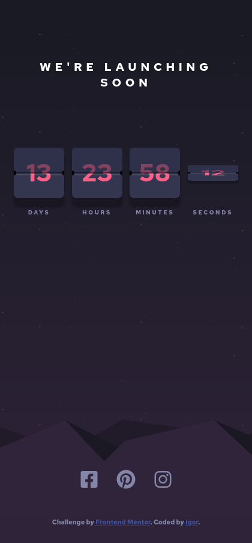
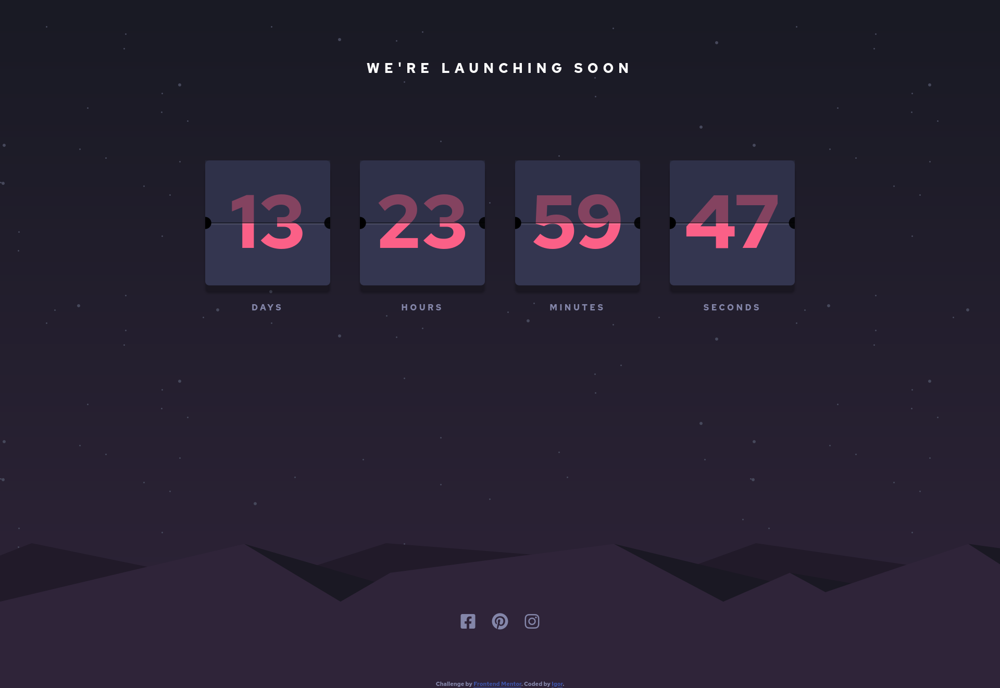

# Frontend Mentor - Launch countdown timer solution

This is a solution to the [Launch countdown timer challenge on Frontend Mentor](https://www.frontendmentor.io/challenges/launch-countdown-timer-N0XkGfyz-). Frontend Mentor challenges help you improve your coding skills by building realistic projects. 

## Table of contents

- [Overview](#overview)
  - [The challenge](#the-challenge)
  - [Screenshot](#screenshot)
  - [Links](#links)
- [My process](#my-process)
  - [Built with](#built-with)
  - [What I learned](#what-i-learned)
  - [Continued development](#continued-development)
  - [Useful resources](#useful-resources)
- [Author](#author)


## Overview

### The challenge

Users should be able to:

- See hover states for all interactive elements on the page
- See a live countdown timer that ticks down every second (start the count at 14 days)
- **Bonus**: When a number changes, make the card flip from the middle

### Screenshot




### Links

- Solution URL: [git](https://github.com/RadasinR/launch-countdown-timer.git)
- Live Site URL: [vercel](https://launch-countdown-timer-seven.vercel.app/)

## My process

### Built with

- Semantic HTML5 markup
- Flexbox
- Canvas
- CSS Grid
- Mobile-first workflow
- Sass


### What I learned

I learnd how to use the html 5 canvas element. How to organize js code.

```html
  <section class="timer">
        <section class="timer__value">
          <section class="countdown">
            <canvas id="days"></canvas>
          </section>

          <section class="timer__label">
            <p>Days</p>
          </section>
        </section>
```
```css
.rotate {
    transform-origin: center;
    transform: rotateX(360deg);
    transition-property: all;
    transition-duration: 0.5s;
}
```
```js
function drawTimer(id, data) {
  const container = document.querySelector(".countdown");
  let canvas = document.getElementById(id);
  let ctx = canvas.getContext("2d");
  const fs = window
    .getComputedStyle(container, null)
    .getPropertyValue("font-size");
  ctx.clearRect(0, 0, canvas.width, canvas.height);
  /* draw number */

  ctx.fillStyle = "hsl(345, 95%, 68%)";
  ctx.font = `${fs} Red Hat Text`;
  ctx.textAlign = "center";
  ctx.fillText(
    data,
    canvas.width / 2,
    canvas.height / 2 +
      Number(fs.slice(0, fs.length - 2)) /
        3 /* (canvas.height - Number(fs.slice(0, fs.length - 2)))  */
  );

  /* draw darker hat */

  ctx.fillStyle = "hsla(235, 21%, 22%, 0.575)";
  ctx.fillRect(0, 0, canvas.width, canvas.height / 2);

  /* draw dark middle line */
  ctx.strokeStyle = "black";
  ctx.lineWidth = 1;
  ctx.beginPath();
  ctx.moveTo(0, canvas.height / 2);
  ctx.lineTo(canvas.width, canvas.height / 2);
  ctx.stroke();
  ctx.closePath();

  /* Light line belowe the dark line */
  ctx.strokeStyle = "rgba(255, 255, 255, 0.09)";
  ctx.lineWidth = 3;
  ctx.beginPath();
  ctx.moveTo(0, canvas.height / 2 + 2);
  ctx.lineTo(canvas.width, canvas.height / 2 + 2);
  ctx.stroke();
  ctx.strokeStyle = "rgba(255, 255, 255, 0.009)";
  ctx.lineWidth = 2;
  ctx.moveTo(0, canvas.height / 2 + 3);
  ctx.lineTo(canvas.width, canvas.height / 2 + 3);
  ctx.stroke();
  ctx.closePath();
  /* end lines */

  /* draw edge circles */

  let radius = container.clientWidth * 0.048;

  ctx.beginPath();
  ctx.fillStyle = "rgba(0, 0, 0, 0.89)";
  ctx.arc(0, canvas.height / 2, radius, Math.PI, -Math.PI);
  ctx.fill();
  ctx.arc(canvas.width, canvas.height / 2, radius, -Math.PI, Math.PI);
  ctx.fill();
}
```


### Continued development
I will continue to learn math so i can make better Computer Graphics.

### Useful resources

- [Canvas basics](https://www.youtube.com/watch?v=Yvz_axxWG4Y) - This helped me with canvas basics.

## Author


- Frontend Mentor - [@Radasin](https://www.frontendmentor.io/profile/Radasin)

